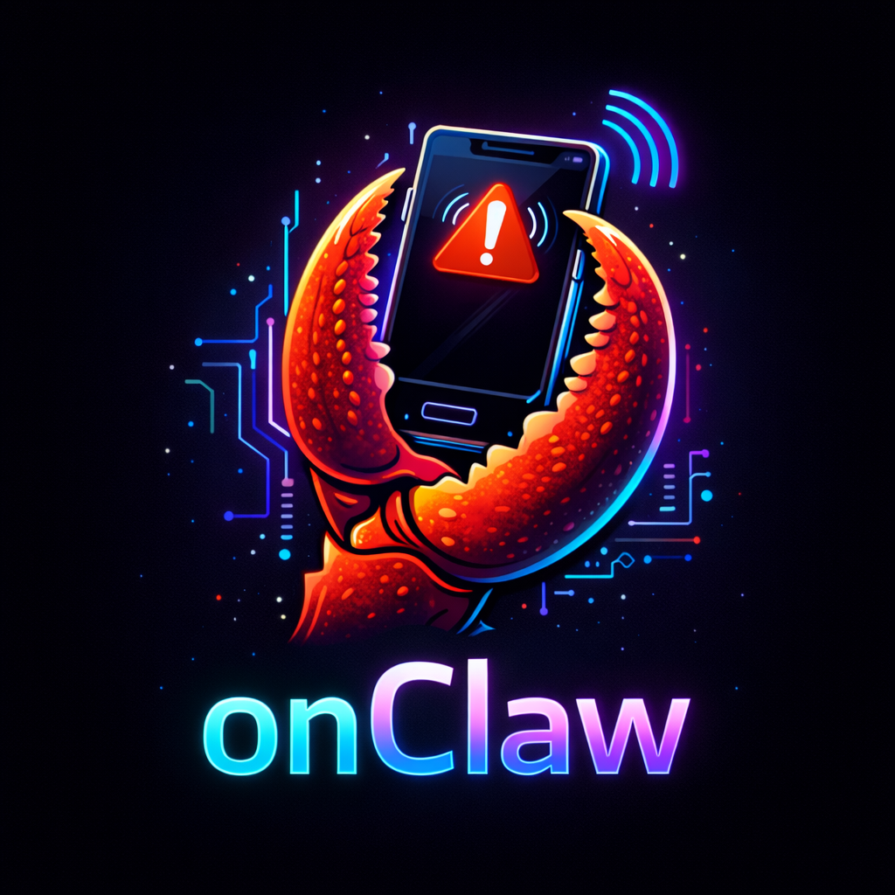

<p align="center">
  
</p>

# Onclaw

Automated on-call first responder for Slack and Telegram. When an alert fires, Onclaw immediately investigates your Kubernetes clusters and replies with an AI-generated summary — root cause analysis, affected pods, relevant logs, and suggested next steps.

**Zero config.** Set your API keys, invite the bot, and run.

## Quick Start

### Telegram

```bash
pip install -e .

export ANTHROPIC_API_KEY="sk-ant-..."
export TELEGRAM_BOT_TOKEN="123456:ABC-..."

python -m onclaw
```

1. Create a bot via [@BotFather](https://t.me/BotFather)
2. Disable privacy mode: `/setprivacy` → **Disable** (so the bot sees all messages, not just commands)
3. Add the bot to your alert groups

### Slack

```bash
export ANTHROPIC_API_KEY="sk-ant-..."
export SLACK_APP_TOKEN="xapp-..."
export SLACK_BOT_TOKEN="xoxb-..."

python -m onclaw
```

### Both platforms simultaneously

Set all tokens — Onclaw runs both listeners in parallel.

## How It Works

```
┌─────────────┐     ┌───────────────────────────┐     ┌───────────────────┐     ┌──────────────┐
│   Slack /    │────▶│        Claude AI           │────▶│ K8s Investigator  │────▶│  Claude AI   │
│  Telegram    │     │ • is this an alert?        │     │ (read-only)       │     │ (summarize)  │
│              │     │ • pick context + namespaces │     │ • pod statuses    │     │              │
│              │     │ • extract pod/service names │     │ • logs + events   │     │              │
└─────────────┘     └───────────────────────────┘     └───────────────────┘     └──────┬───────┘
                                                                                       │
                                                                              ┌────────▼────────┐
                                                                              │  Reply in thread │
                                                                              │  (Slack / TG)    │
                                                                              └────────┬────────┘
                                                                                       │
                                                                              ┌────────▼────────┐
                                                                              │  Store in memory │
                                                                              │  (SQLite)        │
                                                                              └─────────────────┘
```

**Flow:**
1. On startup, discovers all K8s contexts/namespaces from kubeconfig (or in-cluster)
2. Every message in monitored channels goes to AI for classification
3. AI decides: is it an alert? Which cluster, namespace, and pods to check?
4. If alert → "Investigating..." → K8s investigation (read-only) → AI summary → threaded reply
5. Investigation stored in memory — future summaries reference past incidents

## Features

- **Multi-platform** — Slack (Socket Mode) and Telegram (long polling), run one or both
- **Multi-cluster** — auto-discovers all K8s contexts from kubeconfig; works in-cluster + remote simultaneously
- **AI-powered** — no regex or pattern matching; Claude classifies alerts, picks the right cluster/namespace, and generates summaries
- **Investigation memory** — SQLite-backed history; the AI references past incidents to identify recurring issues
- **Read-only** — only reads pod statuses, logs, and events; never modifies your cluster
- **Concurrent** — investigates multiple alerts in parallel with deduplication

## Deployment Options

### Local / VPS

```bash
pip install -e .
export ANTHROPIC_API_KEY="..."
export TELEGRAM_BOT_TOKEN="..."   # and/or SLACK_APP_TOKEN + SLACK_BOT_TOKEN
python -m onclaw
```

Kubeconfig is auto-detected from `~/.kube/config` or set `KUBECONFIG` explicitly.

### Docker

```bash
docker build -t onclaw .
docker run -d \
  -e ANTHROPIC_API_KEY="..." \
  -e TELEGRAM_BOT_TOKEN="..." \
  -v $HOME/.kube/config:/etc/onclaw/kubeconfig:ro \
  -e KUBECONFIG=/etc/onclaw/kubeconfig \
  -v onclaw-data:/data \
  onclaw
```

### Helm (Kubernetes)

```bash
helm install onclaw helm/onclaw \
  --set anthropicApiKey="..." \
  --set telegramBotToken="..." \
  --set slackAppToken="..." \
  --set slackBotToken="..."
```

For multi-cluster from inside K8s, mount a kubeconfig Secret:

```bash
kubectl create secret generic onclaw-kubeconfig --from-file=kubeconfig=$HOME/.kube/config

helm install onclaw helm/onclaw \
  --set anthropicApiKey="..." \
  --set telegramBotToken="..." \
  --set kubeconfig.enabled=true
```

One-click Slack app setup: import [slack-app-manifest.yaml](slack-app-manifest.yaml) at https://api.slack.com/apps.

## Platform Setup

### Slack App

Create at https://api.slack.com/apps (or import the manifest):

| Setting | Value |
|---------|-------|
| **Socket Mode** | Enabled |
| **App-Level Token** | `connections:write` scope → `SLACK_APP_TOKEN` |
| **Bot Token Scopes** | `channels:history`, `channels:read`, `groups:history`, `groups:read`, `chat:write`, `reactions:write` |
| **Event Subscriptions** | `message.channels`, `message.groups` bot events |

Then: `/invite @onclaw` in your alert channels.

### Telegram Bot

1. Message [@BotFather](https://t.me/BotFather) → `/newbot`
2. `/setprivacy` → select your bot → **Disable** (required to read group messages)
3. Add the bot to your alert groups
4. Set `TELEGRAM_BOT_TOKEN` env var

### Kubernetes RBAC

Read-only access — kubeconfig or in-cluster service account:

```yaml
apiVersion: rbac.authorization.k8s.io/v1
kind: ClusterRole
metadata:
  name: onclaw-readonly
rules:
  - apiGroups: [""]
    resources: ["pods", "pods/log", "events", "namespaces"]
    verbs: ["get", "list"]
```

## Configuration

**Config file is optional.** Env vars are enough:

| Env Var | Required | Description |
|---------|----------|-------------|
| `ANTHROPIC_API_KEY` | Yes | Claude API key |
| `SLACK_APP_TOKEN` | No* | Socket Mode token (`xapp-...`) |
| `SLACK_BOT_TOKEN` | No* | Bot OAuth token (`xoxb-...`) |
| `TELEGRAM_BOT_TOKEN` | No* | Telegram bot token from BotFather |
| `KUBECONFIG` | No | Path to kubeconfig (default: `~/.kube/config`) |
| `ONCLAW_MEMORY_PATH` | No | SQLite DB path (default: `onclaw_memory.db`) |
| `CLAUDE_MODEL` | No | Model to use (default: `claude-sonnet-4-20250514`) |
| `CLAUDE_FAST_MODEL` | No | Cheaper model for classification/pod selection (default: `claude-haiku-4-5-20251001`) |
| `CLAUDE_MAX_TOKENS` | No | Max response tokens (default: `4096`) |
| `MAX_LOG_LINES` | No | Log lines per pod (default: `200`) |
| `MAX_CONCURRENT_INVESTIGATIONS` | No | Parallel investigations (default: `3`) |
| `MAX_FOLLOW_UP_DEPTH` | No | Max AI-driven follow-up hops across related pods (default: `3`) |

*At least one platform must be configured (Slack or Telegram).

For a config file: `python -m onclaw -c config.yaml` — see [config.example.yaml](config.example.yaml).

## Project Structure

```
src/onclaw/
├── __main__.py           # CLI entry point
├── app.py                # Startup discovery + wiring
├── config.py             # Env var / YAML config
├── notifier.py           # Platform-agnostic notification (Slack/TG)
├── ai_summarizer.py      # Claude — classify messages, pick context/ns, summarize
├── k8s_investigator.py   # K8s discovery + read-only investigation
├── investigation.py      # Orchestrator (threading, dedup, memory)
├── memory.py             # SQLite investigation history
├── slack_listener.py     # Slack Socket Mode listener
└── telegram_listener.py  # Telegram long-polling listener
```

## Tests

```bash
pip install -e ".[dev]"
pytest tests/ -v
```
